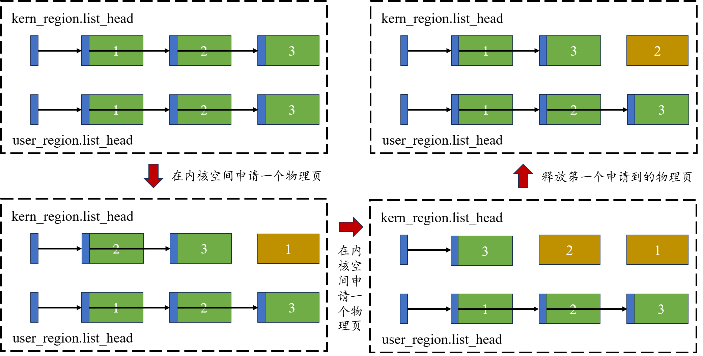

# LAB-1: 机器启动

## 1. 代码组织结构
```
ecnu-oslab-2026
├── Makefile                 编译入口 (CONFIG=<配置名> 选择目标平台)
├── configs/                 配置档案: 每个文件确定 arch+platform+boot 三维
│   ├── riscv64-qemu-virt-sbi.mk
│   └── riscv64-visionfive2-uboot.mk
├── mk/                      构建系统的分层描述
│   ├── common.mk            编译/链接选项、头文件搜索路径
│   ├── arch/riscv64.mk      本架构编译哪些文件、用什么工具链
│   ├── platform/*.mk        本平台需要哪些驱动
│   ├── boot/*.mk            启动路径 (SBI / U-Boot)
│   ├── build.mk             源文件清单与编译规则
│   ├── image.mk             交付镜像 (FIT)
│   └── run.mk               运行 / 烧写
├── include/kernel/          generic kernel 能看到的接口
│   ├── types.h              定长整数、bool、NULL
│   ├── print.h              printf
│   ├── string.h             memcpy / memset / strcmp ...
│   ├── sync.h               自旋锁
│   ├── arch.h               架构抽象接口 (CPU/中断/时间/早期控制台)
│   └── platform.h           平台抽象接口 (板级初始化)
├── arch/riscv64/            RISC-V 相关的一切
│   ├── boot/entry.S         内核第一条指令 (本 lab 的主角之一)
│   ├── boot/start.c         从汇编进入 C 世界
│   ├── trap/early.S         早期 trap 兜底点 (停下来, 而不是跑飞)
│   ├── smp/cpu.c            CPU 身份: hartid / cpuid 换算
│   ├── smp/irq.c            中断开关
│   ├── include/asm/csr.h    CSR 读写
│   ├── include/asm/sbi.h    SBI 调用 (固件控制台等)
│   └── linker/kernel.ld     链接脚本 (段的布局)
├── platform/                机器相关的一切 (地址、中断号、CPU 拓扑)
│   ├── qemu-virt-riscv64/{platform.h, platform.c}
│   └── visionfive2/{platform.h, platform.c}
├── drivers/                 设备协议 (与机器无关的部分)
│   └── serial/uart16550.c    16550 串口驱动 —— 两个平台共用同一份源码
└── kernel/                  generic kernel (不知道自己在哪台机器上)
    ├── init/main.c (TODO)   主入口
    ├── lib/{print.c,string.c}  print.c 含 print_num (TODO)
    ├── lib/console.c         控制台 (把 printf 接到串口)
    └── sync/spinlock.c (TODO)  自旋锁
```

## 2. 实验核心目标

让内核在 QEMU(OpenSBI) 与 VisionFive2(U-Boot) 两块平台上启动，并通过
真实的 16550 串口打印出板级参数 (如下图)



## 3. 机器是怎么启动的

### 3.1 三个阶段

RISC-V 机器上电后的执行路径是：

```
  上电
   │
   ├─ M-mode 固件 (QEMU: OpenSBI / VF2: U-Boot 内部的 OpenSBI)
   │     初始化 DRAM 控制器、时钟、串口……
   │     把下一个阶段的地址和特权级写进自己的寄存器
   │
   ├─ 跳转到 S-mode 的内核入口 (entry.S)
   │     ★ 从这里开始是本课程要写的代码
   │
   └─ 内核
```

固件已经做完了 M-mode 的脏活，所以内核一上来就在 S-mode 运行，不需要自己
写 M-mode 代码再降级。

代价是 S-mode 不能直接写 `mtimecmp`（那是 M-mode 的寄存器），所以设置时钟
中断必须通过 SBI 请固件代劳。这个代价换来的是同一份代码能在所有 RISC-V 平台
上跑（lab-3 会看到）。

### 3.2 固件交给我们的寄存器约定

这是 RISC-V 的 S-mode 启动 ABI，与 Linux 相同：

| 寄存器 | 含义 |
|---|---|
| `a0` | 启动核的 hartid |
| `a1` | 设备树 (DTB) 的物理地址 —— 本课程不使用 DTB，但约定保持一致 |
| `satp` | 0（分页未开启，内核从物理地址开始运行） |
| `sp` | **未定义**！内核必须自己建立栈 |

最后一条最容易出事：内核的第一条指令执行时没有可用的栈。所以 `entry.S` 的
第一件事不是 `call`，而是先算出一个栈地址写进 `sp`。

### 3.3 两台机器传给我们的 hartid 不一样

| | QEMU virt | VisionFive2 |
|---|---|---|
| DRAM 起点 | `0x80000000` | `0x40000000` |
| 内核加载地址 | `0x80200000` | `0x40200000` |
| 启动核 hartid | **0** | **1** |
| 可用的 hart 区间 | `[0, 1]` | `[1, 3]` |
| UART0 地址 | `0x10000000` | `0x10000000` |

VisionFive2 的 hart 0 被监控核占用，所以它的启动核是 hartid **1**。

内核里到处需要的是"第几个核"（我们用 `cpuid` 表示，从 0 开始），而固件给的
是 hartid。两者之间的换算必须由 platform 层提供（`PLAT_BOOT_HART`），因为
"哪些 hart 归内核用"是这台机器的事实。

如果直接在代码里写 `if (hartid == 0)`，那么在 VisionFive2 上没有任何核会
执行启动核的初始化代码 —— 现象是内核一句话都不打印。

### 3.4 从第一条指令到 C 的 `main()`

**`arch/riscv64/boot/entry.S`** 只做四件事：

```
  1. 关掉所有中断
       此时 stvec 还没设置。如果这时来了中断, CPU 会跳到
       stvec 的当前值 —— 可能是 0, 也就是跳进一片垃圾。

  2. 建立栈
       见上面 "sp 未定义"。栈由链接脚本分配的 boot_stacks 数组提供,
       每个 hart 一格, 格子的索引 = hartid - 最小 hartid。
       这个换算用了 platform 层的常量 —— 同一份汇编能服务
       两个 hart 编号区间不同的平台。

  3. 把 hartid 存进 tp
       后面 C 代码要用它。tp 是 thread pointer, 按惯例属于当前
       hart 的私有数据 —— 正好符合 hartid 的语义。

  4. call start
```

**`arch/riscv64/boot/start.c`** 是 C 世界的第一站，它做的是还需要一点汇编
知识的初始化：

- 把 `stvec` 指向 `trap_early_park`（`arch/riscv64/trap/early.S`）——一个
  "停在这里"的死循环。如果此时发生异常，你会看到内核停住（用 gdb 连上去
  pc 就在那个函数里），而不是跳进未初始化的地址后毫无线索。

- 用编译期断言保证"依赖固件的启动协议不会把内核加载到固件区里"：
  `STATIC_ASSERT(EXPECTED_LOAD_ADDR >= PLAT_KERNEL_BASE, ...)`。

- 打印一行"booting via SBI"（走固件控制台），然后才进 `main()`。

这一行走固件控制台而不是串口：因为此时我们还没验证过串口地址是对的。用串口
去打印"串口地址可能是错的"没有意义。固件控制台由固件负责，一定可用。

于是启动时你会看到两行来自不同层次的输出：

```
[oslab] kernel booting via SBI on qemu-virt-riscv64     <- 走固件, 证明 CPU 活着
[platform] qemu-virt-riscv64  DRAM  : ...               <- 走真实串口, 证明板级常量正确
```

## 4. 串口：本实验唯一的设备

### 4.1 为什么是 16550

16550 是 1987 年的 PC 串口芯片，但几乎所有 RISC-V 开发板都集成了它的兼容核。
两个平台的差异全部由 `<platform.h>` 提供：

```c
/* drivers/serial/uart16550.c */
clock = PLAT_UART0_CLOCK;      /* 分频用 */
irq   = PLAT_UART0_IRQ;        /* 注册中断用 */
base  = PLAT_UART0_BASE;       /* 寄存器窗口 */
```

驱动源码一行都不用改。本实验先只用它的输出能力，输入（接收中断）在 lab-3 引入。

### 4.2 波特率分频

串口的波特率由输入时钟分频得到：

```
除数 = 时钟频率 / (16 * 波特率)
```

115200 波特率下：
- QEMU：3686400 / (16 × 115200) = **2**
- VF2 ：24000000 / (16 × 115200) = **13**

分频算错的症状是输出全是乱码 —— 而内核"确实在运行"，所以很容易误判成代码
逻辑问题。

## 5. 具体任务

本分支可以编译运行，但下面这些函数体是空的（`{ }`）。它们都不是"填空"，
需要你理解机制才能写对：

| 文件 | 函数 |
|---|---|
| `kernel/lib/print.c` | `print_num()`：整数 → 字符串 |
| `kernel/sync/spinlock.c` | `spinlock_acquire()`：加锁 |
| `kernel/sync/spinlock.c` | `spinlock_release()`：解锁 |
| `kernel/init/main.c` | `main()` 里补上启动横幅与 `platform_init()` 调用 |

这些之外，本分支的其余代码都是完整的、可以照着读的（`start()` 的机器状态
初始化、串口驱动、链接脚本……都在）。

### 5.1 `print_num()` —— 整数格式化

`kernel/lib/print.c` 里的 `print_num()` 是空的。它的签名告诉你需要支持什么
（进制、符号、宽度、零填充、左对齐），但实现完全由你决定。

要点：
- 数字是逆序生成的（先得到最低位），所以要先存进缓冲区再倒序输出
- 不能用除法库（`nostdlib`），但乘除法指令本身是可用的
- 处理 `0` 与 `INT64_MIN` 两个边界（后者取负会溢出）
- `zero_pad` 与负号同时出现时，负号必须在数字左边、不能被 `0` 挤到中间
- 用 `console_putc` 输出 —— 本函数不应该知道底下是哪个串口

`print_num()` 之外的部分（`vprintf_impl` 的格式串解析、`print_str` 等）已经
写好了，它们会调用你的 `print_num()`。

### 5.2 `spinlock.c` —— 自旋锁

需要实现加锁与解锁。核心是三件事：

1. **原子操作**：用 `amoswap` 一条指令完成"读旧值 + 写新值"，中间不能被打断。
   分成两条指令就会有两个核同时认为自己拿到锁的窗口。
2. **关中断**：单核上"拿锁"和"关中断"必须一起做。只关锁不关中断，中断处理
   函数里再去拿同一把锁就会死锁。
3. **保存/恢复中断状态**，而不是无条件开中断 —— 见 `include/kernel/arch.h`
   里 `arch_irq_save/restore` 的接口语义说明。

### 5.3 `main.c` —— 打印横幅

`main()` 里目前只初始化了串口。请补上：

1. 一个启动横幅（至少包含 `ECNU OSLab 2026` 与平台名）
2. 调用 `platform_init()` 打印本机的板级参数

期望效果见测试一节。

提示：打印内存地址这类数值用 `%lx`（十六进制），不要用 `%d`。

## 6. 测试

### 6.1 QEMU

```bash
make CONFIG=riscv64-qemu-virt-sbi run
```

期望输出（关键部分）：

```
[oslab] kernel booting via SBI on qemu-virt-riscv64

====================================
  ECNU OSLab 2026  (C)
  LAB-1: 机器启动
====================================

[platform] qemu-virt-riscv64  DRAM  : 0x80000000 + 128 MB  kernel: 0x80200000 (镜像实际: 0x80200000)
[platform] cpus  : 2 (启动核 = ..., 平台配置 = 0)  uart  : 0x10000000 (irq 10)   ← 抽签结果, 0 或 1 都可能
```

`平台配置` 来自 `platform.h` 的 `PLAT_BOOT_HART`（固件应该从哪个 hart 启动）；
`启动核` 是固件实际交给内核的那一个，由启动汇编的一次原子交换（抽签）记下来。
两者不同不是内核的 bug —— QEMU 的 virt 机器让所有 hart 并发进入固件，OpenSBI
的冷启动核是抽签决定的，负载高时可能是 hart 1。内核两种情况下都能正常启动。

### 6.2 VisionFive2

```bash
make CONFIG=riscv64-visionfive2-uboot image     # 生成 kernel.itb
```

把 `build/riscv64-visionfive2-uboot/kernel.itb` 复制到 SD 卡第一分区，在
U-Boot 里：

```
fatload mmc 1:1 ${kernel_addr_r} kernel.itb
bootm ${kernel_addr_r}
```

期望看到与 QEMU 上结构完全相同的输出，只是数值不同：`DRAM 0x40000000`、
`kernel 0x40200000`、`boot hart = 1`。

注意必须用 `bootm` 而不是 `go`：`go` 只是跳过去执行，不会设置 `a0`/`a1`，
也不会处理 FIT 镜像的加载地址。用错命令的症状是内核看起来启动了但所有地址
都是错的。

## 7. 课后实验

### 7.1 并行加法

```c
    volatile static int started = 0;

    volatile static int sum = 0;

    int main()
    {
        int cpuid = r_tp();
        if(cpuid == 0) {
            print_init();
            printf("cpu %d is booting!\n", cpuid);
            __sync_synchronize();
            started = 1;
            for(int i = 0; i < 1000000; i++)
                sum++;
            printf("cpu %d report: sum = %d\n", cpuid, sum);
        } else {
            while(started == 0);
            __sync_synchronize();
            printf("cpu %d is booting!\n", cpuid);
            for(int i = 0; i < 1000000; i++)
                sum++;
            printf("cpu %d report: sum = %d\n", cpuid, sum);
        }
        while (1);
    }
```

在 **main.c** 中测试上述代码，预期是后 report 的 cpu 告诉我们 `sum = 2000000`，
但实际结果可能是这样的：

```
cpu 0 is booting!
cpu 1 is booting!
cpu 0 report: sum = 1128497
cpu 1 report: sum = 1143332
```

考虑如何使用锁进行修正，修正后的输出可能是这样的：

```
cpu 0 is booting!
cpu 1 is booting!
cpu 0 report: sum = 1996573
cpu 1 report: sum = 2000000
```

简单说明上锁和解锁的位置不同会有什么影响（tips: 锁的粒度粗细）。

### 7.2 并行输出

尝试去掉 `printf` 里的锁，参考 7.1 的实验思路，设计测试方法使得 `printf` 的
输出出现交错的情况。

7.1 和 7.2 的测试代码和实验结果可以附在你的 README 中，但是不要体现在你的
代码里。

## 8. 关于代码仓库的维护

1. 每次实验需要在上次实验的基础上继续往下做，假设你已经完成 lab-0(master)

    那么你此时应该在 lab-0(master) 分支下使用 `git checkout -b lab-1` 命令
    创建并切换到新的分支 lab-1

    此时新建的 lab-1 会继承 lab-0(master) 的内容，但你对 lab-1 的修改不会
    影响到 lab-0

    以此类推，当你从 lab-1 开始走到 lab-9 时，你会获得越来越完整和强大的内核

2. 你的代码仓库应该由 **代码 + Markdown文档** 两部分构成

    文档内容不做明确要求，你有很高的自由度决定写什么和写多少

    提供一些建议：

    - 本次实验新增了哪些功能，实现了什么效果

    - 对本次实验中某个过程的理解和思考

    - 本次实验和之前的实验构成什么样的逻辑联系

    - 本次实验花费的时间, 你和队友的贡献分别是什么

    - 可以使用 markdown 的分层分点来增加条理性，便于别人阅读和抓住重点

    **总之，这是你的代码仓库，请对你自己的代码和文档负责**

    **注意，代码是继承和连续发展的, 但文档不是，每次的文档都是全新一页**

3. 提醒: 之所以要求大家维护代码仓库，是为了查看大家的提交记录

    所以请及时同步当天写的代码到线上仓库，不要攒到最后一口气提交，否则可能
    被误判为不当行为

---

## 8. 进阶目标（可选）

下面三条**不属于基本验收**：默认流程与本分支 README 的期望输出都不依赖它们。
它们的作用是把这一阶段的内核"做完整一点"——每条都只用到**本章已经给出的东西**，
不碰后面阶段的文件。每条写了"为什么值得做""思路（只说做法，不写代码）""怎么算做到"。

> 动手前先建自己的分支（例如 `git checkout -b my-advanced`）。
> **别破坏默认输出**：进阶改动如果改变了默认运行结果，后面几章的对照实验就失效了；
> 需要改默认行为时，用一个新的 `configs/` 配置或一个运行期开关把它隔开。

---

### 8.1 bootinfo：把"这次启动是怎么发生的"收进一个结构

**为什么值得做**：现在"固件怎么交接"这件事散在三个地方——入口汇编里 a0/a1 的约定、
`start.c` 里存 hartid、`main` 里再用这些值。加第二个启动协议时这些假设会被各写一遍，
而且很容易漏（漏一个的症状是"另一个协议下莫名跑飞"）。

**思路**：
- 定义一个只描述**本次启动事实**的结构（不要放平台事实，平台事实仍然归 `platform/`）：
  启动 hart、DTB 物理地址、早期控制台来源、协议名、固件是否提供"启动其他 hart"的能力……
- 由 `mk/boot/<协议>.mk` 选中的那份实现负责填它，`start.c` 只把它转交给 `main`
- `main` 与 `kernel/` 里其它代码不再直接接触 a0/a1，只读这个结构
- 两个现有协议（SBI / 裸机直启）都要能填出完整内容，并打印一行便于对照

**怎么算做到**：两个现有协议下结构内容都正确；`main` 里不再出现"a0/a1 的原始语义"；
再加一个协议时 `kernel/` 一行都不用改。

**涉及**：`arch/riscv64/boot/entry.S`、`arch/riscv64/boot/start.c`、`mk/boot/*.mk`、`kernel/init/main.c`　**难度**：★★☆

### 8.2 dtb 动态发现：平台事实的第二个来源

**为什么值得做**：`platform.h` 里的 DRAM 基址、UART 地址、CPU 数量现在都是**编译期常量**。
真实板子上这些来自固件给的设备树——而 a1 里一直拿着 DTB 的物理地址，本课程却把它丢掉了。
做完这条，你会同时理解"为什么需要 platform 层"和"平台层的事实从哪来"。

**思路**：
- 写一个最小的 FDT 遍历器：校验 header 魔数，然后按结构块走（开始节点/属性/结束节点），
  取出三件事：`/memory` 的 reg（DRAM 基址与大小）、`/cpus` 的 timebase-frequency 与 hart 列表、
  串口节点的 reg（UART 基址）
- 与 `platform.h` 的编译期值**逐个对账**：一致就打印"一致"，不一致就以 DTB 为准并打印警告
- 注意 FDT 是**大端**，而且字段偏移都来自外来数据：每一处长度与偏移都要做边界检查
- 可以先把 DTB 导出到文件离线观察：`qemu-system-riscv64 -machine virt,dumpdtb=/tmp/virt.dtb`

**怎么算做到**：两个平台都能打印"从 DTB 读到的 DRAM/CPU/UART"三行，
并给出与编译期值的一致/不一致结论；DTB 被截断时能报错而不是崩。

**涉及**：`arch/riscv64/boot/start.c`、`platform/*/platform.c`、`include/kernel/platform.h`　**难度**：★★★

### 8.3 UEFI：第三个启动协议（可以先只做骨架）

**为什么值得做**：这条检验的是本项目的核心设计目标——"启动维度可替换"是否真的成立。
UEFI 与现有两种协议差别极大：产物是 PE/COFF、靠 Boot Services 拿内存与输出、
退出服务后没有任何固件回调可用。

**思路**（分两级，建议先做 L1）：
- **L1 只做骨架**：新增一个启动协议的构建描述 + 一份入口实现，把 bootinfo 填好，
  产物转换成 PE/COFF；目标是在 QEMU 的 OVMF 固件下被加载并打印出第一行。
  全程**不改 `kernel/`**，这正是要证明的东西。
- **L2 才做真正的引导**：用 Boot Services 拿内存图、配置输出，`ExitBootServices` 之后再跳内核。
- 关键差异提前想清楚：UEFI 下没有 SBI 控制台，早期输出从哪来？
  （这正是 bootinfo 里"早期控制台来源"那一项存在的理由。）

**怎么算做到**：L1 在 OVMF 下能看到内核第一行输出，且 `git diff --stat kernel/` 为空；
L2 能把内存图交给物理页分配器，并说明它与 `platform.h` 的关系。

**涉及**：`mk/boot/`（新增）、`configs/`（新增）、`arch/riscv64/boot/`、`mk/image.mk`　**难度**：★★★（L1 ★★☆）
