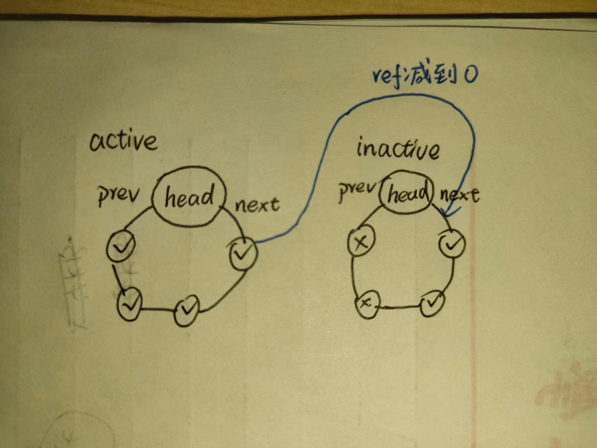
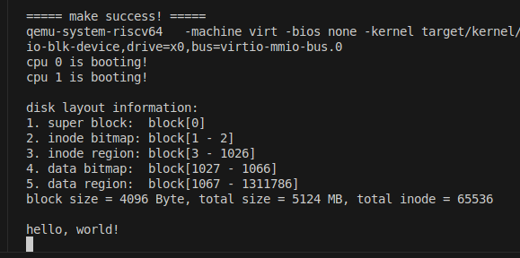
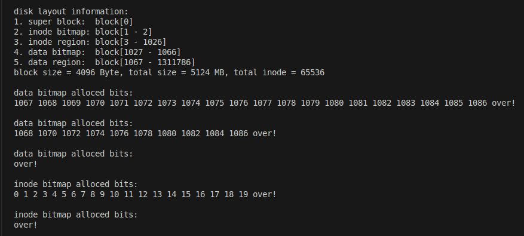
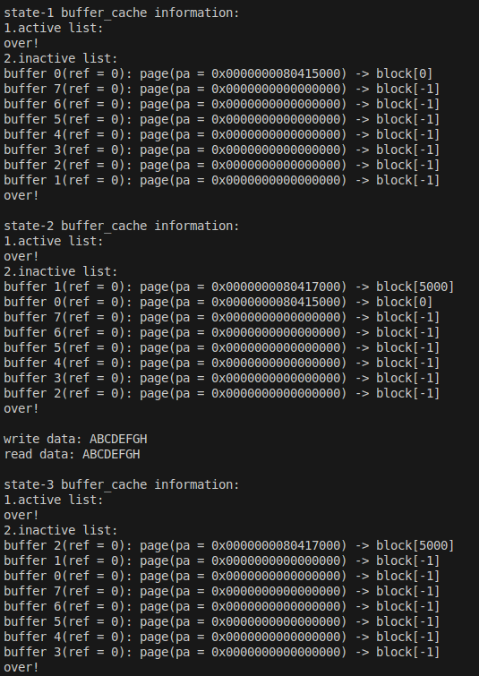
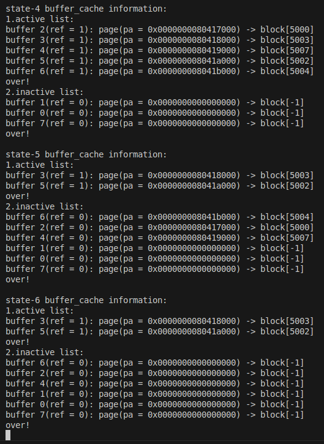

# LAB-7: 文件系统 之 磁盘管理

**前言**

本次实验我们将围绕磁盘管理构建文件系统的基础设施

1. 首先讨论QEMU启动时的输入参数disk.img是如何构建的

2. 随后讨论以block为基本单位的磁盘读写如何实现, 包括驱动本身+OS提供的配合

3. 随后讨论磁盘与内存进行数据交换的桥梁--缓冲系统(buffer)

4. 最后讨论磁盘上bitmap区域的管理方法

## 代码组织结构

```
ECNU-OSLAB-2026
├── pictures       README使用的图片目录 (CHANGE, 日常更新)
├── README.md      实验指导书 (CHANGE, 日常更新)
├── include
│   ├── kernel/fs.h (NEW, 文件系统接口)
│   └── uapi
│       ├── disk.h (NEW, 磁盘布局)
│       └── syscall.h (CHANGE, 系统调用号)
├── drivers/block
│   ├── virtio_blk.c (NEW, QEMU磁盘驱动)
│   └── sd.c (NEW, VisionFive2磁盘驱动)
├── kernel
│   ├── mem/kvm.c (TODO, 磁盘映射与内核地址翻译)
│   ├── trap/trap.c (TODO, 磁盘中断使能与处理)
│   ├── proc/schedule.c (TODO, 首进程中初始化文件系统)
│   ├── syscall
│   │   ├── syscall.c (CHANGE, 系统调用分派)
│   │   └── disk.c (TODO, 磁盘测试系统调用)
│   ├── fs
│   │   ├── block.c (TODO, 磁盘寄存器映射)
│   │   ├── bitmap.c (TODO, bitmap相关操作)
│   │   ├── buffer.c (TODO, 内存中的block缓冲区管理)
│   │   └── fs.c (TODO, 文件系统初始化)
│   └── main.c (TODO, 增加block_init)
├── tools/mkfs.c (NEW, 磁盘映像初始化)
└── user
    ├── init.c (按测试需求修改)
    ├── sys.h (CHANGE)
    └── syscall.c (CHANGE)
```

**标记说明**

**NEW**: 新增源文件, 直接拷贝即可, 无需修改

**CHANGE**: 旧的源文件发生了更新, 直接拷贝即可, 无需修改

**TODO**: 你需要实现新功能 / 你需要完善旧功能

## 磁盘的初始状态--disk.img如何构建

在QEMU中引入磁盘这种新的外设, 需要增加启动参数。请关注**mk/run.mk**中的以下部分:

```text
-global virtio-mmio.force-legacy=false
-drive file=$(DISK),if=none,format=raw,id=x0
-device virtio-blk-device,drive=x0,bus=virtio-mmio-bus.0
```

它定义了磁盘在启动时的初始状态为disk.img, 同时启动了一个虚拟磁盘设备作为disk.img的载体

**disk.img不是凭空产生的,它是如何构建的呢？**

请你关注**tools/mkfs.c**和**include/uapi/disk.h**源文件

简单来说, 它负责创建和打开一个文件, 并向这个文件写入一些信息进行文件系统格式化

通过`fopen + fwrite + ftruncate + fclose`这组常见的文件接口来实现 (注意, 它不是基于我们实现的内核, 而是Linux)

具体来说, 磁盘可以被看作以block为基本单位的长数组, **include/uapi/disk.h**规定了磁盘布局结构如下:

**[ superblock | inode bitmap | inode region | data bitmap | data region ]**

- block是磁盘的基本逻辑单位, 磁盘由若干block构成, block的大小规定为**BLOCK_SIZE**, 这里与**PAGE_SIZE**保持一致

- 第1部分由**1个**block构成, 被称为超级块, 记录了文件系统和磁盘的相关信息(布局、魔数、块大小等), 是最重要的元数据

- 第2、3部分描述文件系统元数据, 第4、5部分描述文件系统数据, 他们都是**element_bitmap + element_region**的结构

- 第3部分包括N个inode, 第2部分描述第3部分各个inode元素是否分配出去了 (bit为1代表已分配, bit为0代表未分配)

- 第5部分包括M个data block, 第4部分描述第5部分各个data block元素是否分配出去了 (bit为1代表已分配, bit为0代表未分配)

通过修改**N_INODE**和**N_DATA_BLOCK**, 我们可以控制元数据资源池和数据资源池的大小, 进而影响disk.img的大小

初始化结束后, disk.img中的**superblock**完成了设置, **inode bitmap**和**data bitmap**全部清零

使用`make CONFIG=riscv64-qemu-virt-sbi disk`创建镜像, 随后可用`make CONFIG=riscv64-qemu-virt-sbi run`启动。镜像默认位于`build/riscv64-qemu-virt-sbi/disk.img`, 运行命令不会替你格式化已有镜像。需要清空重建时, 在disk命令后加上`MKFS_FLAGS=--force`。

VisionFive2使用microSD, 镜像可用`make CONFIG=riscv64-visionfive2-uboot disk`生成。将disk.img写入从扇区2097152开始的实验区, 该区域至少需要10494296个512字节扇区, 不应与启动分区重叠。内核用`make CONFIG=riscv64-visionfive2-uboot image`生成kernel.itb, 沿用lab-1的U-Boot加载步骤启动。具体布局与写入方法见[开发板磁盘说明](docs/visionfive2-sd.md)。

注意: 在本次实验中, 你只需要知道**inode region**是一个区别于**data region**的区域即可, 不需要对inode有细致了解

## 构建block-level的读写能力

构建disk.img后, 我们还需要构建读写它的基本能力, 才能实现数据的持久化存储

前面提到过, 磁盘的基本管理单位是block, 因此我们首先考虑如何构建block-level的读写能力

我们之前学习过另一种具备读写能力的外设--UART(串口), 可以获得以下启示:

- 需要**磁盘驱动程序**, 通过一系列寄存器操作实现读写能力

- 需要与OS的陷阱子系统密切配合, 实现中断响应函数 (磁盘操作很费时, 本实验采用中断方式)

**1. 首先讨论磁盘驱动程序的部分 (了解即可)**

驱动程序非常复杂, 且和设备寄存器耦合严密, 不是学习的重点, 只需要知道它提供的接口即可

请你查看**kernel/fs/block.c**源文件, 它为QEMU的VirtIO驱动和VisionFive2的SD驱动提供统一接口, 包括以下几个函数:

```c
/* block.c: 以block为单位的磁盘读写能力 */

int block_init(void); // 磁盘初始化, 成功返回0
int block_rw(buffer_t *b, bool write); // 磁盘读写, 成功返回0
void block_interrupt(void); // 磁盘中断处理
```

- `block_init`与磁盘进行通信并让它进入READY状态

- `block_rw`提供了以block为单位的读写能力, 供buffer子系统使用

- `block_interrupt`是磁盘中断处理流程, 当磁盘完成一次I/O时会通过中断系统提醒OS, 唤醒等待磁盘资源的进程

**2. 再讨论OS如何与磁盘驱动配合 (需要你做)**

- 系统初始化(**kernel/main.c**): 主核调用`block_init`, 完成后再使能磁盘中断

- 内存系统(**kernel/mem/kvm.c**): 需要在内核页表初始化时调用`block_map`, 完成磁盘相关寄存器的映射工作。VisionFive2还需要映射用于DMA缓存维护的CCACHE寄存器

- 内存系统(**kernel/mem/kvm.c**): `block_rw`通过`kvm_translate`翻译内核栈中请求头的地址, 请实现这个函数。`vm_getpte`仍需传入有效页表, 不用NULL表示内核页表

- 陷阱系统(**kernel/trap/trap.c**): 为`BLOCK_IRQ`设置PLIC优先级, 并在各核使能磁盘中断

- 陷阱系统(**kernel/trap/trap.c**): 在外设中断处理流程中增加磁盘中断的处理分支, 调用`block_interrupt`后完成中断响应

## 建立磁盘与内存的数据交换桥梁--缓冲系统 (buffer)

```c
/* 以Block为单位在内存和磁盘间传递数据 */
typedef struct buffer {
    uint32 block;                    // 磁盘内block序号, 由buffer_lock保护
    uint32 refs;                     // 引用数, 由buffer_lock保护
    bool valid;                      // 数据是否有效, 由睡眠锁保护
    bool disk;                       // 是否仍在等待磁盘, 由驱动的请求锁保护
    int io_result;                   // I/O结果, 由驱动的请求锁保护
    uint8* data;                     // block数据, 内容由睡眠锁保护
    sleeplock_t lock;                // 睡眠锁
    struct buffer *prev, *next;      // 链表指针, 由buffer_lock保护
} buffer_t;
```

首先, 数据要从内存写入磁盘, 需要将内存缓冲区与磁盘中block的序号进行绑定, 指导`block_rw`的工作

因此, **buffer_t**需要包括**uint32 block**和**uint8* data**来记录这种绑定关系

此外, 磁盘是共享资源, 可能有多个进程同时访问一个block的情况

因此, 需要引入睡眠锁**lock**保证高效的有序访问, 引入计数器**refs**防止过早释放资源

最后, **valid**用于判断缓存内容是否有效, **disk**和**io_result**供**block.c**记录请求状态和结果

```c
buffer_t buffer_cache[N_BUFFER];
buffer_t active_head, inactive_head;
spinlock_t buffer_lock;
```

类似之前**mmap**的管理方式, **buffer结构体资源**被组织为两个带头节点的双向循环链表

**1. 资源初始化 (buffer_init)**

非活跃链表(以**inactive_head**为头节点)中所有元素的refs都等于0 (无人引用)

活跃链表(以**active_head**为头节点)中所有元素的refs都大于0 (有人引用)

因此, 在初始化时, buffer_cache中所有buffer的refs设为0, block设为**BLOCK_UNUSED**

随后, 将所有初始化的buffer插入非活跃链表 (我们希望第一个buffer最后位于inactive_head->next)

**2. 资源获取 (buffer_get)**

buffer在链表间/链表内的移动遵守LRU原则: 最活跃的资源位于head->next, 最不活跃的资源位于head->prev


当上层尝试获取某个block对应的buffer时(如图片所示):

- 我们首先尝试在活跃链表中寻找 (从head->next开始), 找到后将它移动到活跃链表的head->next

- 如果找不到则尝试在不活跃链表中开始寻找 (从head->next开始), 找到后将它移动到活跃链表的head->next

- 如果还是找不到, 说明缓存失败: 将非活跃链表尾部的buffer拿出来, 设置block, 移动到活跃链表的head->prev

取得睡眠锁后, 如果valid为true, 就可以返回buffer。否则需要先去磁盘中读入目标block。即使命中同一块号, 数据页被回收后也需要重新读盘。

注意: 通过buffer_get获取的buffer, 对应的refs应该+1, 记录被使用的次数。应在缓存锁内增加引用数, 然后释放缓存锁再等待睡眠锁, 避免等待时buffer被回收

**3. 资源释放 (buffer_put)**

buffer释放时先释放睡眠锁, 再在缓存锁内将refs减1, 如果减到0, 则移动到不活跃链表的head->next



**4. 关于buffer控制的物理内存的申请和释放**

我们按照自动申请, 手动释放的原则管理buffer控制的物理内存资源 (大小为BLOCK_SIZE, 与物理页一样大)

具体来说:

- 在`buffer_get`获取不活跃链表中的元素时, 检查buf->data是否为NULL, 是的话申请一个物理页

- 在`buffer_freemem`中扫描不活跃链表中的若干最不活跃元素, 尝试释放buffer_count个物理页, 并清除valid。发布或清空data指针时也需要持有缓存锁

**5. 基于buffer的block读写**

`buffer_read` 和 `buffer_write` 的底层都是 `block_rw`

只是在此基础上增加了睡眠锁检查, 确保调用者持有锁后才能进入耗时的磁盘操作

**6. 典型的buffer使用方法**

```c
/* 常规流程 */ 
buffer_t* buf = buffer_get(block_num);
do_something_in_buf_data();
buffer_write(buf); // 也可以只读不修改
buffer_put(buf);

/* 一段时间后可能存在大量无用缓存 */
buffer_freemem(N_BUFFER);

```

## 使用buffer: 读入superblock

让我们来利用刚刚建立的缓冲系统做点重要的事情: 读入超级块

**首先考虑读入的时机: 可以在main函数中完成吗?**

不能, 因为磁盘读入会触发`proc_sleep`和`proc_wakeup`

所以需要在用户进程的上下文中执行, 而不是在初始化过程中执行

**什么时刻是最早的时机呢?**

初始化过程中通过`proc_make_first`准备好了**proczero**, 并将它的context.ra设为`proc_first_return`

之后初始化过程进入调度器逻辑(`proc_scheduler`), 将控制流切换到**proczero**

因此, 最早的时机就是**proczero**第一次进入`proc_first_return`时!

我们在这里释放调度器交来的进程锁, 再由proczero调用一次`fs_init`进行文件系统初始化, 目前主要用于初始化缓冲系统和读入superblock。读入块0后, 按小端格式解码并检查各区域的位置和大小。

考虑到debug的方便性, 请在读入superblock后输出磁盘布局信息 (通过`sb_print`)

## 使用buffer: bitmap管理

bitmap的管理以bit为基本粒度, 因此需要单独开辟一套管理逻辑

- 当申请一个data block或inode时, 对应bitmap的某个bit被置为1

- 当释放一个data block或inode时, 对应bitmap的对应bit被置为0

请你基于buffer来实现以下函数:

```c
uint32 bitmap_alloc_block();
uint32 bitmap_alloc_inode();
void bitmap_free_block(uint32 block_num);
void bitmap_free_inode(uint32 inode_num);
```

**它们的共同逻辑:**

- `bitmap_search_and_set`: 在1个bitmap_block中从头向后扫描bit流, 找到第一个为0的bit, 设置为1并返回索引号, 块内无空位时返回BLOCK_UNUSED

- `bitmap_clear`: 将bitmap_block中的某个bit设为0

**需要注意的问题:**

- bitmap区域可能横跨多个block, 寻找空闲bit时需要遍历

- bitmap区域的最后一个block可能只用了一部分, 寻找空闲bit时需要传入有效范围

- 细心一点, 可以通过逐字节遍历和逐bit位运算来寻找空闲bit

`bitmap_alloc_block`返回文件系统内的绝对块号, `bitmap_alloc_inode`返回从0开始的inode编号。

## 增加系统调用

我们需要增加以下11个系统调用的支持, 以支持后面的用户态测试用例

```c
#define SYS_ALLOC_BLOCK 11  // 从data_bitmap申请1个block (测试bitmap_alloc_block)
#define SYS_FREE_BLOCK 12   // 向data_bitmap释放1个block (测试bitmap_free_block)
#define SYS_ALLOC_INODE 13  // 从inode_bitmap申请1个inode (测试bitmap_alloc_inode)
#define SYS_FREE_INODE 14   // 向inode_bitmap释放1个inode (测试bitmap_free_inode)
#define SYS_SHOW_BITMAP 15  // 输出目标bitmap的状态
#define SYS_GET_BLOCK 16    // 获取1个描述block的buffer (测试buffer_get)
#define SYS_READ_BLOCK 17   // 将buf->data拷贝到用户空间
#define SYS_WRITE_BLOCK 18  // 基于用户地址空间更新buffer->data并写入磁盘 (测试buffer_write)
#define SYS_PUT_BLOCK 19    // 释放1个描述block的buffer (测试buffer_put)
#define SYS_SHOW_BUFFER 20  // 输出buffer链表的状态
#define SYS_FLUSH_BUFFER 21 // 释放非活跃链表中buffer持有的物理内存资源 (测试buffer_freemem)
```

请你结合**kernel/syscall/disk.c**的注释和后面给出的测试用例来理解这些系统调用的输入输出

几乎都是先做参数读取, 然后调用对应的实现函数, 请你实现这些系统调用, 这里不做详细介绍

`get_block`返回的数值用来标识内核中的buffer, 用户程序只需保存并原样传回, 不要将它当作用户地址访问。每次获取后只归还一次, 尚未归还时不要调用fork或exit。`read_block`和`write_block`每次复制完整的BLOCK_SIZE字节。

`show_bitmap`的参数0表示data, 1表示inode, 而`bitmap_print`的布尔参数true表示data, 调用时需要作相应转换。`flush_buffer`成功时返回0, 不直接返回`buffer_freemem`回收的页数。

## 测试用例

测试开始前, 请将**include/kernel/fs.h**中的**N_BUFFER**从16384改成**N_BUFFER_TEST**, 方便测试。下面三组程序分别替换**user/init.c**。测试3会直接写入块5000, 请使用新建的专用测试镜像。

测试用例包括三个部分:

1. 什么都不做, 测试superblock信息能否正常输出, 检验磁盘和缓冲系统的基本能力

2. 测试bitmap中资源申请和释放的正确性

3. 测试缓冲系统的LRU管理逻辑是否生效

**test-1**

```c
// test-1: read superblock
#include "sys.h"

void user_main(void)
{
	print_str("hello, world!\n");
	while(1);
}
```

测试现象示意:



**test-2**

```c
// test-2: bitmap
#include "sys.h"

#define NUM 20
#define N_BUFFER 8

void user_main(void)
{
	unsigned int block_num[NUM];
	unsigned int inode_num[NUM];

	for (int i = 0; i < NUM; i++)
		block_num[i] = alloc_block();

	flush_buffer(N_BUFFER);
	show_bitmap(0);

	for (int i = 0; i < NUM; i+=2)
		free_block(block_num[i]);
	
	flush_buffer(N_BUFFER);
	show_bitmap(0);

	for (int i = 1; i < NUM; i+=2)
		free_block(block_num[i]);

	flush_buffer(N_BUFFER);
	show_bitmap(0);

	for (int i = 0; i < NUM; i++)
		inode_num[i] = alloc_inode();

	flush_buffer(N_BUFFER);
	show_bitmap(1);

	for (int i = 0; i < NUM; i++)
		free_inode(inode_num[i]);

	flush_buffer(N_BUFFER);
	show_bitmap(1);

	while(1);
}
```

测试现象示意:



**test-3**

```c
#include "sys.h"

#define PGSIZE 4096
#define N_BUFFER 8
#define BLOCK_BASE 5000

void user_main(void)
{
	/* 两页缓冲区放在堆上, 避免一次跨过多页用户栈。 */
	unsigned long top = brk(0);
	if (brk(top + 2 * PGSIZE) != (long)(top + 2 * PGSIZE)) while (1);
	char *data = (char *)top, *tmp = (char *)(top + PGSIZE);
	for (int i = 0; i < PGSIZE; i++) data[i] = tmp[i] = 0;
	unsigned long long buffer[N_BUFFER];

	/*-------------一阶段测试: READ WRITE------------- */

	/* 准备字符串"ABCDEFGH" */
	for (int i = 0; i < 8; i++)
		data[i] = 'A' + i;
	data[8] = '\n';
	data[9] = '\0';

	/* 查看此时的buffer_cache状态 */
	print_str("\nstate-1 ");
	show_buffer();

	/* 向BLOCK_BASE写入字符 */
	buffer[0] = get_block(BLOCK_BASE);
	write_block(buffer[0], data);
	put_block(buffer[0]);

	/* 查看此时的buffer_cache状态 */
	print_str("\nstate-2 ");
	show_buffer();

	/* 清空内存副本, 确保后面从磁盘中重新读取 */
	flush_buffer(N_BUFFER);

	/* 读取BLOCK_BASE*/
	buffer[0] = get_block(BLOCK_BASE);
	read_block(buffer[0], tmp);
	put_block(buffer[0]);

	/* 比较写入的字符串和读到的字符串 */
	print_str("\n");
	print_str("write data: ");
	print_str(data);
	print_str("read data: ");
	print_str(tmp);

	/* 查看此时的buffer_cache状态 */
	print_str("\nstate-3 ");
	show_buffer();

	/*-------------二阶段测试: GET PUT FLUSH------------- */
	
	/* GET */
	buffer[0] = get_block(BLOCK_BASE);
	buffer[3] = get_block(BLOCK_BASE + 3);
	buffer[7] = get_block(BLOCK_BASE + 7);
	buffer[2] = get_block(BLOCK_BASE + 2);
	buffer[4] = get_block(BLOCK_BASE + 4);

	/* 查看此时的buffer_cache状态 */
	print_str("\nstate-4 ");
	show_buffer();

	/* PUT */
	put_block(buffer[7]);
	put_block(buffer[0]);
	put_block(buffer[4]);

	/* 查看此时的buffer_cache状态 */
	print_str("\nstate-5 ");
	show_buffer();

	/* FLUSH */
	flush_buffer(3);

	/* 查看此时的buffer_cache状态 */
	print_str("\nstate-6 ");
	show_buffer();

	while(1);
}
```
测试现象示意:





**尾声**

本次实验只是第三阶段的热身和铺垫~

我们引入了磁盘这种外设并具备了block-level的管理能力

在lab-8中, 我们要用inode将block组织起来并构建层次化的数据存储系统

我们即将进入真正的文件系统逻辑, 请你做好准备迎接新的挑战!

## 进阶目标

### 缓存策略

本次实验中，我们使用 LRU 管理缓冲块。如果连续读取一个较大的文件，原先经常使用的缓冲块会不会被淘汰？

请你尝试另一种缓存策略，与 LRU 进行比较。可以先构造重复读取少量磁盘块和顺序读取大量磁盘块两组测试，记录实际读盘次数。注意：仍在使用的缓冲块不能被回收。

### MBR/GPT

一块磁盘可以划分成多个分区，MBR和GPT就是记录分区位置和大小的两种格式。本实验在QEMU中直接使用磁盘镜像，在VisionFive2上使用固定位置的实验区，还没有通过分区表寻找文件系统。

请你尝试解析分区表，在块设备之上增加分区内读写接口。可以先区分扇区、磁盘块和分区偏移的单位，再用含多个分区的镜像观察各分区的起止位置，测试越界请求和无效表头，确认写入不会影响相邻分区。

### 异步 I/O

目前调用者提交磁盘请求后，会睡眠等待传输完成。异步I/O允许调用者先去做其他工作，等收到完成通知后再使用结果。等待期间，请求使用的数据页仍需留给设备。

请你在现有驱动之上设计非阻塞提交和完成通知，可以从请求句柄、队列满时的处理和数据页的使用期限入手。同时提交多个请求，比较等待时间和吞吐量，并观察取消请求时页面是否仍被设备访问。
